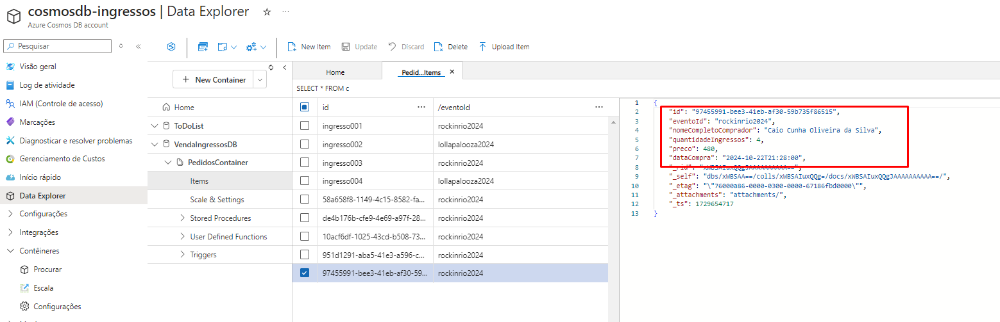
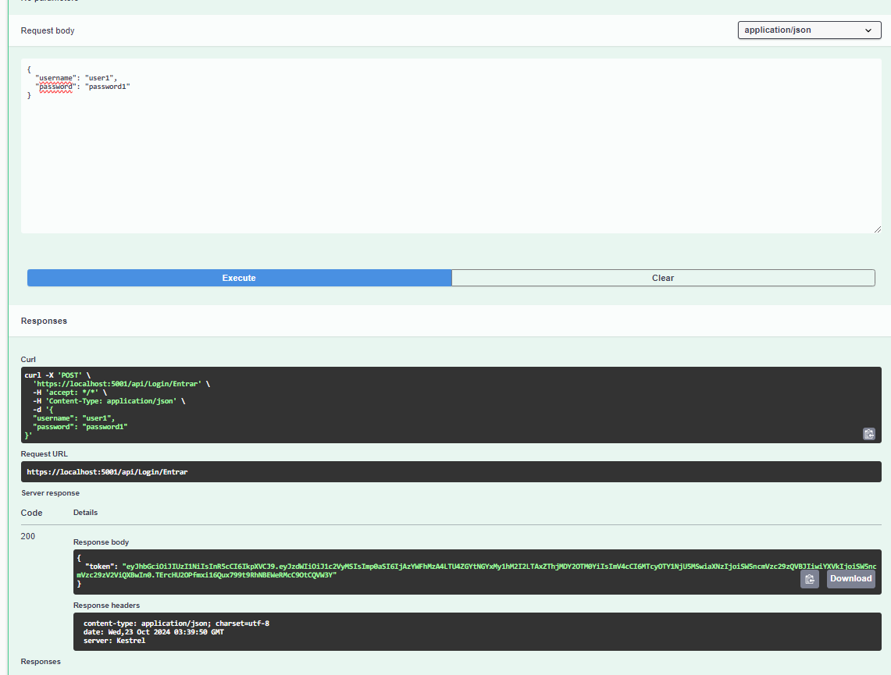
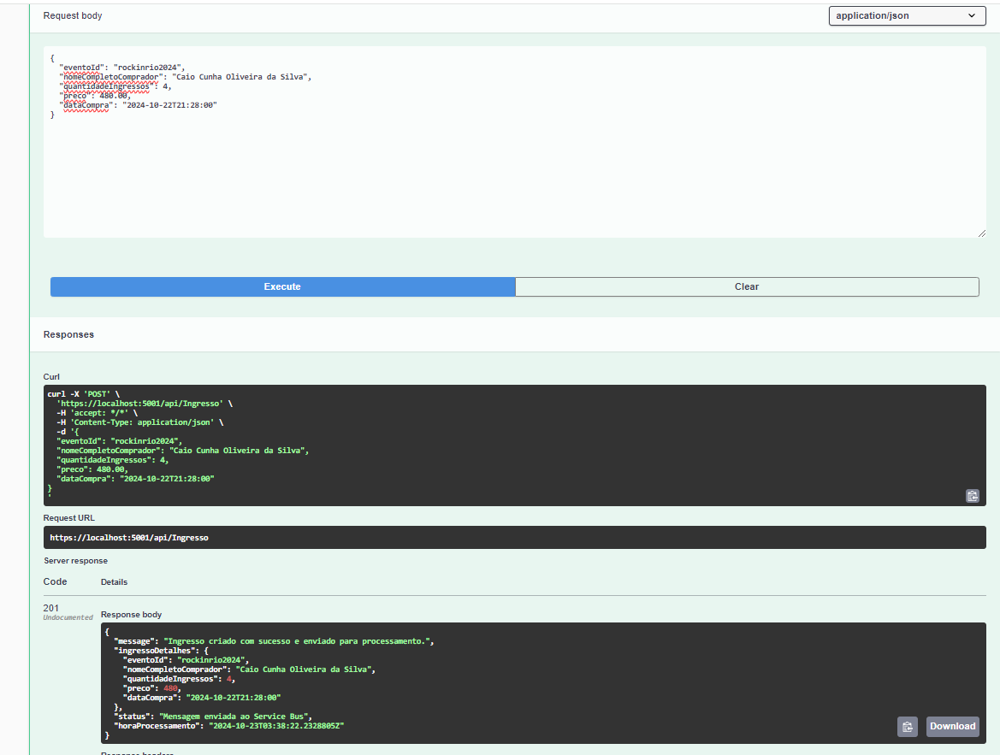
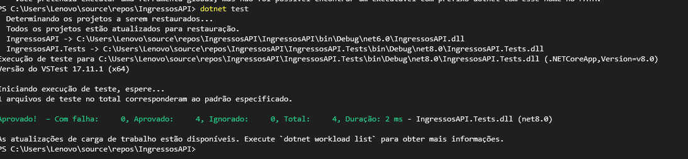
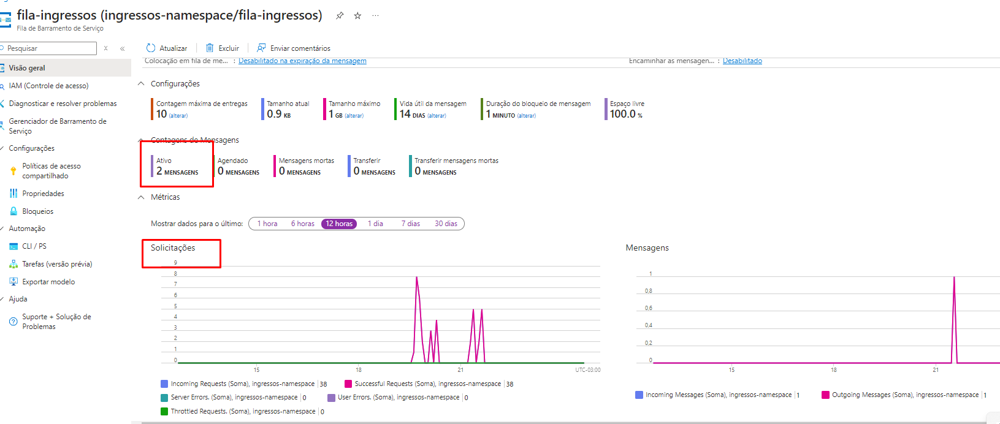

# IngressosAPI

IngressosAPI é uma API RESTful desenvolvida em ASP.NET Core que permite a compra e gerenciamento de ingressos para eventos, utilizando gRPC para comunicação rápida, Azure Service Bus para gerenciamento de mensagens assíncronas e CosmosDB para armazenamento de dados. Além disso, a API implementa autenticação baseada em JWT para garantir a segurança nas operações.

---

## Funcionalidades

- **Gerenciamento de Ingressos**: Criação, leitura e processamento de ingressos.
- **Comunicação Rápida**: Utilização de gRPC para interações eficientes entre serviços.
- **Mensageria**: Integração com Azure Service Bus para gerenciamento assíncrono de mensagens.
- **Armazenamento**: Uso do Azure CosmosDB para persistência de dados.
- **Segurança**: Implementação de autenticação JWT para proteger endpoints.

---

## Imagens de Testes

### 1. Consumo do CosmosDB


### 2. Requisição de Token


### 3. Requisição POST


### 4. Testes Unitários


### 5. Comunicação com o Service Bus


---

## Como Executar

1. Clone o repositório:
   ```bash
   git clone https://github.com/CaioCunha10/IngressosManagementAPI.git
